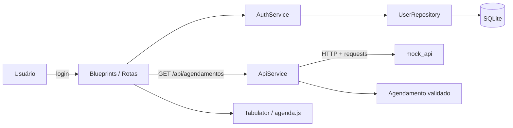
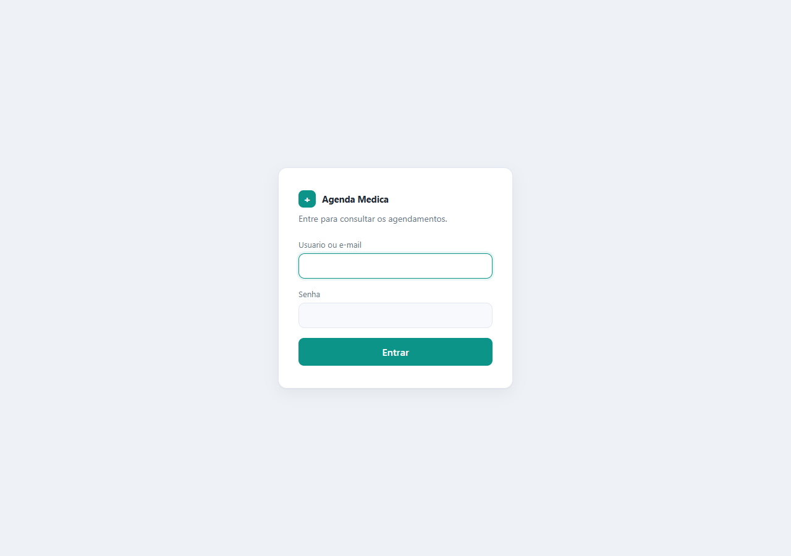
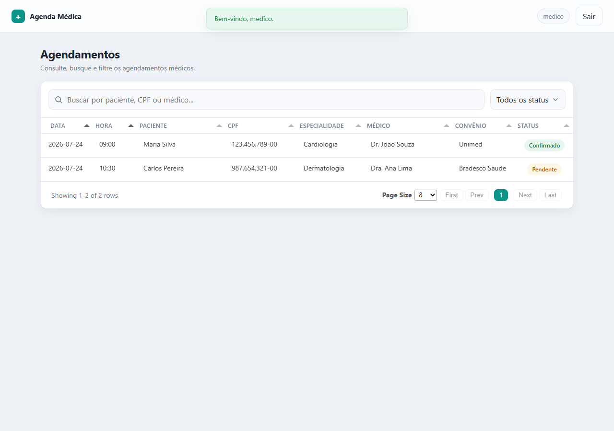

# Agenda Médica

Aplicação web de **agenda médica**: autenticação de usuário e listagem de
agendamentos em tabela interativa (Tabulator), consumindo uma **API HTTP
separada**. Construída com foco em arquitetura em camadas, resiliência a
falhas e boas práticas de Clean Code.

> Desafio técnico — Flask · SQLite · Docker · integração HTTP · tratamento de falhas.

---

## Índice

- [Descrição](#descrição)
- [Arquitetura](#arquitetura)
- [Tecnologias](#tecnologias)
- [Como executar](#como-executar)
- [Docker](#docker)
- [Credenciais](#credenciais)
- [Estrutura de pastas](#estrutura-de-pastas)
- [Screenshots](#screenshots)
- [Decisões técnicas](#decisões-técnicas)
- [Tratamento de erros](#tratamento-de-erros)
- [Possíveis melhorias](#possíveis-melhorias)
- [Licença](#licença)

---

## Descrição

O usuário faz login com **usuário ou e-mail + senha** (validados contra um banco
SQLite). Autenticado, é redirecionado para a tela principal, onde os agendamentos
— buscados via **requisição HTTP** a um microserviço — são exibidos em uma tabela
Tabulator com busca, filtro, ordenação e paginação.

A aplicação foi desenhada para **nunca quebrar diante de falhas**: API fora do ar,
resposta inválida, banco indisponível ou campos ausentes resultam em mensagens
amigáveis e logs — nunca em tracebacks na tela.

## Arquitetura

Arquitetura em **camadas**, com o domínio independente do framework. Cada camada
tem uma responsabilidade única; as rotas apenas orquestram.

```
Rotas (Blueprints)  →  Services  →  Repositories / ApiService  →  Models / API
      HTTP              regras          acesso a dados            entidades
```



- **Blueprints (`app/blueprints`)** — camada HTTP. Não contêm regra de negócio nem
  fazem requests diretos.
- **Services (`app/services`)** — regras de aplicação. `AuthService` (autenticação) e
  `ApiService` (integração HTTP resiliente).
- **Repositories (`app/repositories`)** — única fronteira com o banco; traduz falhas
  de infraestrutura em exceções de domínio.
- **Models (`app/models`)** — `User` (SQLAlchemy) e `Agendamento` (dataclass validada,
  não persistida).
- **Exceptions (`app/exceptions`)** — exceções de domínio tipadas.
- **Errors (`app/errors`)** — handlers globais que garantem respostas amigáveis.

## Tecnologias

| Categoria | Stack |
|---|---|
| Linguagem | Python 3.12 |
| Web | Flask 3 · Jinja2 |
| ORM / Banco | Flask-SQLAlchemy · SQLite |
| Integração | requests |
| Front-end | Tabulator 6 (vendorizado, sem CDN) · CSS próprio |
| Servidor (prod) | Gunicorn |
| Config | python-dotenv |
| Testes | pytest |
| Infra | Docker · Docker Compose |

## Como executar

### Docker (recomendado)

```bash
cp .env.example .env
docker compose up --build
```

Sobe **tudo com um único comando** — sem passo manual: cria o banco, roda o seed e
sobe a aplicação (Gunicorn) e o microserviço de API.

- Aplicação: <http://localhost:5000>
- Mock API: <http://localhost:5001/agendamentos>

### Terminal (sem Docker)

```bash
cp .env.example .env
python -m venv .venv && source .venv/bin/activate   # Windows: .venv\Scripts\activate
pip install -r requirements.txt

python seed.py                       # prepara banco + usuário de teste
python mock_api/app.py &             # microserviço de agendamentos (porta 5001)
python run.py                        # aplicação (porta 5000)
```

### Testes

```bash
pytest
```

## Docker

Dois serviços orquestrados via `docker-compose.yml`:

| Serviço | Porta | Função |
|---|---|---|
| `web` | 5000 | Aplicação Flask servida por Gunicorn (config de produção) |
| `mock_api` | 5001 | Microserviço que simula a API de agendamentos |

- **SQLite** é um banco embarcado (arquivo), persistido via volume nomeado
  `sqlite_data` — não é um container separado.
- **Seed automático**: o `web` executa `python seed.py` antes de servir, criando
  tabelas e usuário de teste de forma idempotente.
- **Variáveis sensíveis** (chave secreta, credenciais do seed, URL/timeout da API)
  ficam em `.env` (fora da imagem via `.dockerignore`); `.env.example` documenta todas.

## Credenciais

Usuário de teste criado pelo seed (valores em `.env`):

| Campo | Valor |
|---|---|
| Usuário | `medico` |
| E-mail | `medico@teste.com` |
| Senha | `medico123` |

O login aceita **usuário ou e-mail** no mesmo campo.

## Estrutura de pastas

```
app/
  __init__.py        application factory (create_app)
  config.py          config por ambiente (variáveis de ambiente)
  extensions.py      instância única do SQLAlchemy
  messages.py        mensagens amigáveis centralizadas
  blueprints/        camada HTTP (auth, agenda)
  services/          regras de aplicação (auth + integração HTTP via ApiService)
  repositories/      acesso a dados (fronteira do banco)
  models/            User (SQLAlchemy) e Agendamento (dataclass validada)
  exceptions/        exceções de domínio tipadas
  errors/            handlers globais de erro
  utils/             infra transversal (logging, segurança/CSRF)
  templates/         Jinja (base, login, agenda, error)
  static/            CSS/JS + Tabulator vendorizado
mock_api/            microserviço separado que simula a API de agendamentos
logs/                logs da aplicação (app.log)
seed.py              cria tabelas + usuário de teste (idempotente)
tests/               pytest
Dockerfile · docker-compose.yml · .env.example · requirements.txt
```

## Screenshots

> As imagens ficam em `docs/screenshots/`.

| Login | Agenda |
|---|---|
|  |  |

## Decisões técnicas

- **Arquitetura em camadas** — domínio isolado do Flask; rotas finas, regra em
  services. Facilita teste e evolução.
- **Exceções de domínio tipadas** — infraestrutura (timeout, `SQLAlchemyError`) é
  traduzida em exceções de negócio (`ApiIndisponivelError`, `BancoIndisponivelError`),
  mantendo as camadas superiores agnósticas de detalhes técnicos.
- **`ApiService` resiliente** — nunca lança para o chamador: em qualquer falha devolve
  lista vazia + aviso amigável, garantindo que a página nunca quebre.
- **CSRF sem dependência extra** — token de sessão com `secrets.compare_digest`, em
  vez de puxar Flask-WTF só para isso.
- **Tabulator vendorizado** — servido localmente, sem depender de CDN em runtime.
- **Gunicorn em produção** — o container serve com Gunicorn e `FLASK_ENV=production`
  (debug desligado), em vez do servidor de desenvolvimento do Flask.
- **SQLite com caminho absoluto** — evita ambiguidade entre execução local e no
  container.

## Tratamento de erros

Todos os cenários exigidos são tratados com **mensagem amigável + log**, sem expor
traceback:

| Cenário | Tratamento | Log |
|---|---|---|
| Credenciais inválidas | mensagem clara (401), sem revelar qual campo | WARNING |
| Nenhum agendamento | placeholder na tabela | — |
| Resposta vazia/inválida da API | `ApiRespostaInvalidaError` → fallback + aviso | ERROR |
| API indisponível / timeout | `ApiIndisponivelError` → fallback + aviso | WARNING |
| Erro de conexão com o banco | `BancoIndisponivelError` → 503 amigável | ERROR |
| Campos obrigatórios ausentes | registro descartado + aviso | WARNING |
| Busca sem resultado | placeholder "Nenhum resultado para sua busca." | — |
| Entradas vazias/inválidas | validadas, sem erro interno | — |

- **Handlers globais** (`app/errors`) capturam `BancoIndisponivelError`, `DomainError`,
  `404`, demais `HTTPException` e qualquer `Exception`, respondendo **JSON** nas rotas
  `/api` e **página HTML amigável** (`error.html`) nas demais.
- **Logging** em console e arquivo rotativo (`logs/app.log`), com nível e logger por
  módulo.

## Possíveis melhorias

- Logging estruturado em **JSON** (integração com agregadores como ELK/Datadog).
- **Healthchecks** no compose com `depends_on: condition: service_healthy`.
- Migrations com **Alembic** no lugar do `create_all`.
- Paginação/busca **server-side** para grandes volumes de agendamentos.
- CI (lint + testes) e cobertura mínima obrigatória.
- Hardening de sessão (`SESSION_COOKIE_SECURE`) atrás de HTTPS.

## Licença

Distribuído sob a licença **MIT**. Veja [`LICENSE`](LICENSE).
